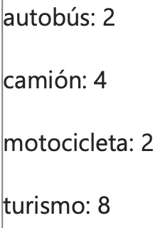
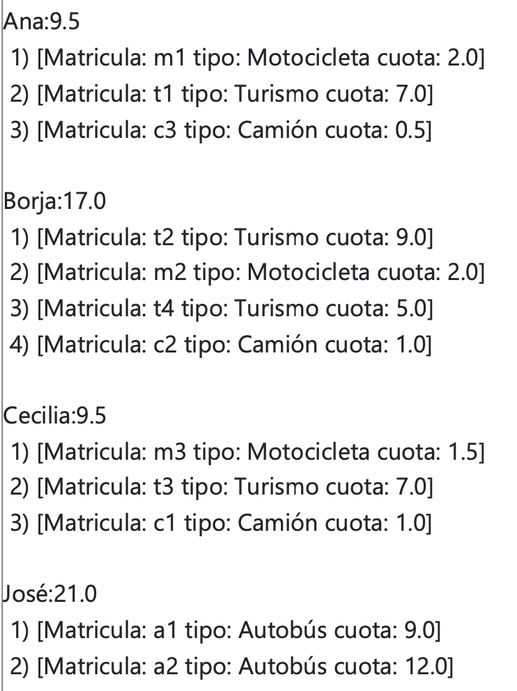

# Concesionario

## Enunciado

Se desea desarrollar una aplicación para la gestión de préstamos de un concesionario de alquiler vehículos (un rent a car). En el diseño de la aplicación se han identificado las entidades vehículo, arrendatario y concesionario, para las que se han definido las correspondientes clases.

La clase Vehículo representa los distintos tipos de vehículos que se alquilan en el concesionario: turismo, motocicleta, camión y autobús. Las vehículos tienen, además, un modelo que los identifica y una cuota mensual del préstamo concedido al propietario. El importe de la cuota se calcula teniendo en cuenta la suma del alquiler de cada vehículo arrendado. Esta clase está parcialmente implementada y en el código suministrado en la actividad VPL se detallan los métodos públicos y qué funcionalidad tienen.

La clase Arrendatario representa a las personas que alquilan los vehículos del concesionario a su nombre. El arrendatario se identifica mediante un nombre y tiene asociado el conjunto de vehículos de las que es arrendatario, a partir de las cuales se calcula la cantidad que representa la cuota mensual. La interfaz de la clase Arrendatario dispone de los siguientes métodos públicos:

| Método                          | Descripción                                                                                                                                                                                                                                                                                                                                                      |
| ------------------------------- | ---------------------------------------------------------------------------------------------------------------------------------------------------------------------------------------------------------------------------------------------------------------------------------------------------------------------------------------------------------------- |
| `Arrendatario(String)`          | Constructor al que se le pasa una String con el nombre del arrendatario.                                                                                                                                                                                                                                                                                         |
| `String getNombre()`            | Devuelve el nombre del arrendatario.                                                                                                                                                                                                                                                                                                                             |
| `void addVehiculo(Vehiculo)`    | Añade la vehiculo pasado por parámetro al conjunto de vehículos del arrendatario, si no está ya.                                                                                                                                                                                                                                                                 |
| `void removeVehiculo(String)`   | Elimina un vehículo del arrendatario a partir de su matricula. Si no existe no hace nada.                                                                                                                                                                                                                                                                        |
| `List<Vehiculo> getVehiculos()` | Devuelve una lista con los vehículos del arrendatario.                                                                                                                                                                                                                                                                                                           |
| `double cuotaTotal()`           | Devuelve la cuota total del arrendatario correspondiente a todos las vehículos que tiene alquilados.                                                                                                                                                                                                                                                             |
| `String toString()`             | Devuelve una String con un listado numerado empezando en uno (después del número va un cierra paréntesis y un espacio en blanco) de todos las vehículos del arrendatario separadas por saltos de línea ("\n") y precedidas por el nombre del arrendatario seguido de dos puntos y la cuota y un salto de línea, por ejemplo:  |

La clase Concesionario representa el conjunto de arrendatarios de los diferentes vehículos del negocio. Dispone de los siguientes métodos públicos:

| Método                                 | Descripción                                                                                                                                                                                                                                                                                                                             |
| -------------------------------------- | --------------------------------------------------------------------------------------------------------------------------------------------------------------------------------------------------------------------------------------------------------------------------------------------------------------------------------------- |
| `Concesionario (String, double)`       | Constructor al que se le pasa una String con el nombre de la concesionario y una cantidad que corresponde al presupuesto anual del negocio.                                                                                                                                                                                             |
| `void addArrendatario(Arrendatario)`   | Añade un arrendatario al concesionario. Si ya existe uno con el mismo nombre lo sustituye por el nuevo.                                                                                                                                                                                                                                 |
| `void removeArrendatario(String)`      | Elimina un arrendatario a partir de su nombre. Si no existe no hace nada.                                                                                                                                                                                                                                                               |
| `double cuotaMensual(Arrendatario)`    | Devuelve la cuota mensual a pagar por el arrendatario, indicado en el parámetro, para todos sus vehículos arrendados.                                                                                                                                                                                                                   |
| `Arrendatario getArrendatario(String)` | Devuelve un arrendatario a partir de su nombre. Si no existe devuelve null.                                                                                                                                                                                                                                                             |
| `List<String> getVehiculosDistintos()` | Devuelve una lista de tipos de vehículos en orden alfabético para un concesionario. Cada elemento es una cadena de texto que se obtiene concatenando el tipo de vehículo seguido del carácter dos puntos y un espacio en blanco (": ") y seguido del número de vehículos de cada tipo. Por ejemplo:  |
| `String toString()`                    | Devuelve una String con la concatenación de todos los arrendatarios del concesionario ordenados alfabéticamente se la siguiente forma:                                                                                                                                                               |

---

## Ejercicio OOP

Realice la implementación de las distintas clases según los requisitos descritos en el enunciado añadiendo los atributos y los métodos de la clase Object que cree oportunos para su correcto funcionamiento en el resto de la aplicación, usando los contenedores de la librería de Java más adecuados.

> Ficheros aportados por el profesor:
> 
> * [Vehiculo.java](./OOP/Vehiculo.java)
> * [ConcesionarioMain.java](./OOP/ConcesionarioMain.java)

## Ejercicio GUI

El ejercicio a realizar consiste en el desarrollo de las clases ConcesionarioMain, ArrendatarioDlg y VehiculoDlg que permitan crear el concesionario e introducir los arrendatarios y los vehículos, respectivamente.

Desarrolle la interfaz gráfica que permita crear un concesionario al que se le puedan añadir arrendatarios con sus vehículos correspondientes. La aplicación está parcialmente implementada, debiendo añadir el diálogo que permite crear un nuevo arrendatario con sus vehículos. La interfaz debe parecerse lo más posible a la solución aportada.

> Ficheros aportados por el profesor:
> 
> * [ConcesionarioMain.java](./GUI/ConcesionarioMain.java)
> * [VehiculoDlg.java](./GUI/VehiculoDlg.java)
